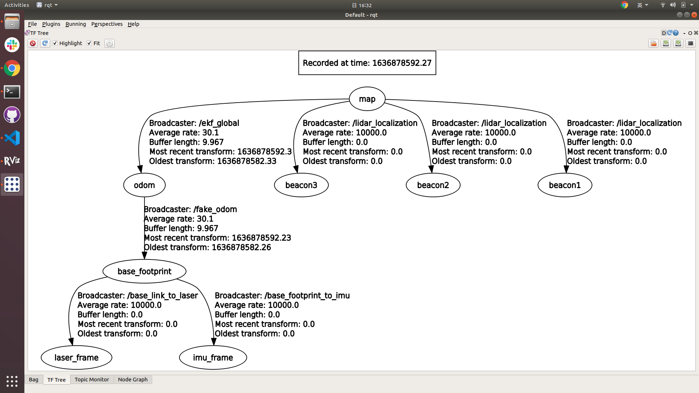
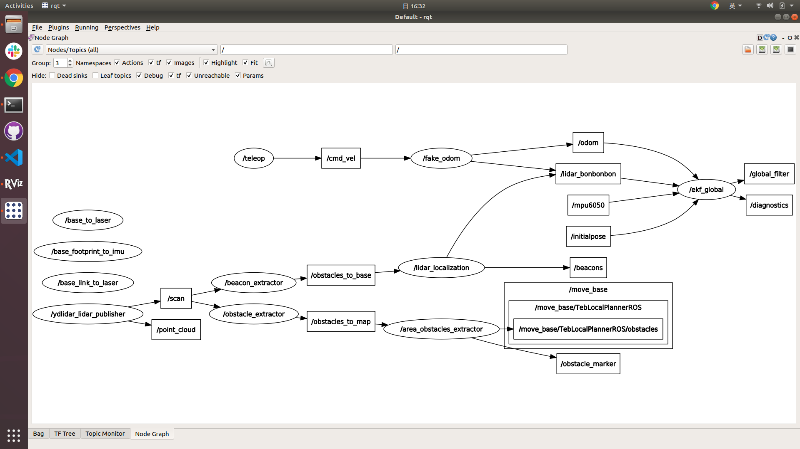

# Eurobot ROS workspace

This ROS workspace for Eurobot includes localization and 2-D simulation (stage).

It works for computers and RPi 4.

## Environment

Ubuntu 18.04 / ROS melodic

Ubuntu 20.04 / ROS noetic

## Download

**HTTPS**
```
git clone --recurse-submodules https://github.com/sunfu-chou/eurobot_ros_ws.git
```

## ROS dependencies 
1. navigation
2. costmap_converter
3. teb_local_planner
4. robot_localization

## Build

### Build and Install YDLidar-SDK

```bash
# WORKDIR . (root of the repo)
mkdir src/YDLidar-SDK/build
cd src/YDLidar-SDK/build
cmake ..
make
sudo make install
```

[NOT necessary]

You can discard changes after build and install by

```bash
# WORKDIR ./src/YDLidar-SDK/build
cd ..
git reset --hard
git clean -fd
```

### Install ROS package

```bash
sudo apt install -y \
ros-${ROS_DISTRO}-navigation \
ros-${ROS_DISTRO}-costmap-converter \
ros-${ROS_DISTRO}-teb-local-planner \
ros-${ROS_DISTRO}-robot-localization
```

### Build the workspace

```bash
# WORKDIR . (root of the repo)
catkin_make
```
## Connect to YDlidar (Only for RPi)

### Create serial port alias
```
chmod +x ./rename_RPI_USB_ports.sh
sudo ./rename_RPI_USB_ports.sh
```

### Test connection
```
roslaunch eurobot lidar_G6.launch
```


## Run localization

Don't need to launch lidar before localization
### Launch Odom Publisher

Topic `odom` is needed
1. Launch rosserial, rx_to_odom, etc. on Raspberry Pi to publish `odom`
2. Launch `fake_odom`
```
roslaunch fake_odom fake_odom.launch
```

### Launch Localization
```
roslaunch eurobot localization.launch
```
Including `lidar_G6`, `localization`, `ekf`



